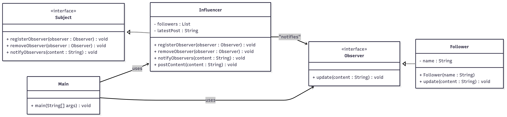

# Observer Pattern - Social Media Influencer  

## Use Case  
A *social media notification system* where followers automatically receive updates when an influencer posts new content, similar to Instagram/YouTube notifications.  

---

## What It Solves  
- Automatically notifies all followers when new content is posted  
- Maintains loose coupling between influencer and followers  
- Enables one-to-many dependency between objects  

---

## Classes  

### 🔹 Observer (Interface)  
Defines the update contract.  
- `update(String content)` → Receives notification with post content  

### 🔹 Follower  
Implements **Observer** interface to receive influencer notifications.  
- Stores follower name  
- Displays notification when influencer posts  

### 🔹 Subject (Interface)  
Defines subject contract for managing observers.  
- `registerObserver(Observer)` → Adds new follower  
- `removeObserver(Observer)` → Removes follower  
- `notifyObservers(String)` → Notifies all followers  

### 🔹 Influencer  
Implements **Subject** interface to manage followers and post content.  
- Maintains list of followers  
- `postContent(String)` → Posts new content and notifies all followers  

### 🔹 Main  
Demonstrates observer pattern by registering followers, posting content, and showing dynamic unsubscription.  

---

##  Class Diagram  

Below is the class diagram representing the observer pattern :  



---

## How to Run  

```bash
# Compile
javac Main.java

# Run
java Main
