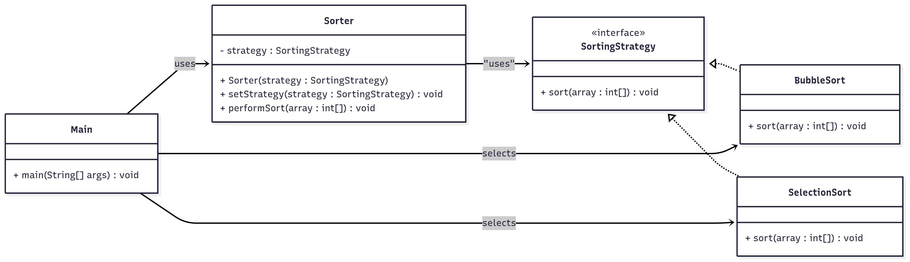

# Strategy Pattern - Sorting Algorithms  

## Use Case  
A *sorting system* that can switch between different sorting algorithms (*Bubble Sort, Selection Sort*) at runtime without changing the client code.  

---

## What It Solves  
- Allows algorithm selection at runtime  
- Encapsulates sorting algorithms in separate classes  
- Makes it easy to add new sorting algorithms  
- Eliminates conditional statements for algorithm selection  

---

## Classes  

### 🔹 SortingStrategy (Interface)  
Defines the strategy contract.  
- `sort(int[] array)` → Sorts the given array  

### 🔹 BubbleSort  
Implements bubble sort algorithm.  
- Compares adjacent elements and swaps if needed  

### 🔹 SelectionSort  
Implements selection sort algorithm.  
- Finds minimum element and places it at the beginning  

### 🔹 Sorter (Context)  
Maintains reference to a **SortingStrategy** object.  
- `setStrategy(SortingStrategy)` → Changes sorting algorithm at runtime  
- `performSort(int[])` → Executes the current sorting strategy  

### 🔹 Main  
Demonstrates strategy pattern by sorting arrays using different algorithms without changing the **Sorter** code.  

---

##  Class Diagram  

Below is the class diagram representing the strategy pattern :  



---

## How to Run  

```bash
# Compile
javac Main.java

# Run
java Main
