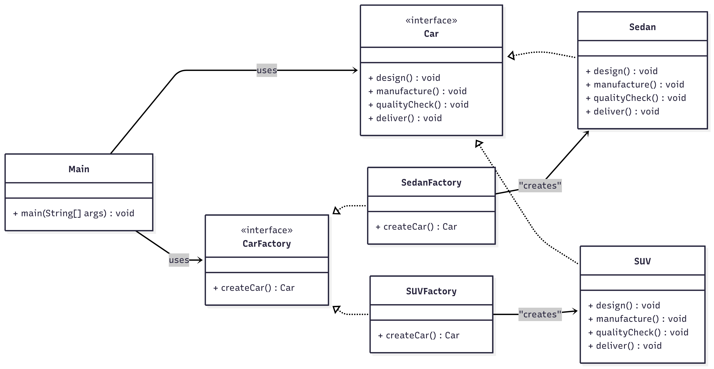

# Factory Method Pattern - Car Manufacturing  

## Use Case  
A *car manufacturing system* that produces different types of vehicles (*Sedan, SUV*) through their respective factories, following a standardized production process.  

---

## What It Solves  
- Decouples car creation logic from client code  
- Allows adding new car types without modifying existing code  
- Standardizes manufacturing process across all car types  
- Makes the system extensible for future car models  

---

## Classes  

### 🔹 Car (Interface)  
Defines the manufacturing contract with methods:  
- `design()` → Design phase  
- `manufacture()` → Manufacturing phase  
- `qualityCheck()` → Quality control phase  
- `deliver()` → Delivery phase  

### 🔹 Sedan  
Implements **Car** interface for sedan-type vehicles with *rooftop* and *power engine*.  

### 🔹 SUV  
Implements **Car** interface for SUV-type vehicles with *AI assistant* and *electric engine*.  

### 🔹 CarFactory (Interface)  
Defines factory contract with `createCar()` method.  

### 🔹 SedanFactory  
Creates and returns **Sedan** objects.  

### 🔹 SUVFactory  
Creates and returns **SUV** objects.  

### 🔹 Main  
Demonstrates the factory pattern by creating different car types through their respective factories.  

---

##  Class Diagram  

Below is the class diagram representing the factory pattern :  



---

## How to Run  

```bash
# Compile
javac Main.java

# Run
java Main
