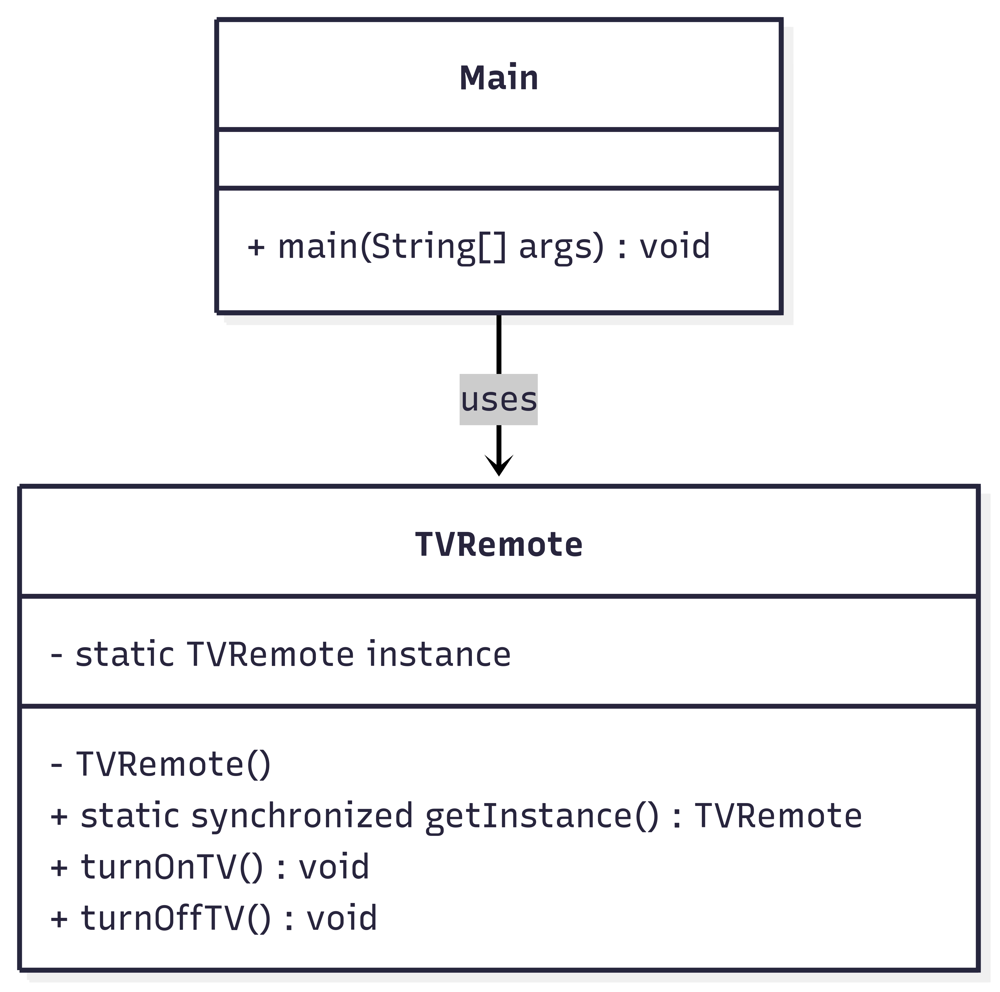

# Singleton Pattern - TV Remote  

## Use Case  
A *TV remote control system* where only one remote instance should exist to control a single TV, preventing multiple conflicting remote objects.  

---

## What It Solves  
- Prevents creation of multiple remote control instances  
- Ensures global access to a single remote object  
- Avoids conflicting commands from multiple remote instances  
- Thread-safe remote control management  

---

## Classes  

### 🔹 TVRemote (Singleton)  
Thread-safe singleton class managing TV operations.  

**Methods:**  
- `getInstance()` → Returns the single remote instance  
- `turnOnTV()` → Powers on the television  
- `turnOffTV()` → Powers off the television  

### 🔹 Main  
Demonstrates singleton behaviour by creating two references to the same remote instance.  

---

##  Class Diagram  

Below is the class diagram representing the singleton pattern :  



---

## How to Run  

```bash
# Compile
javac Main.java

# Run
java Main


