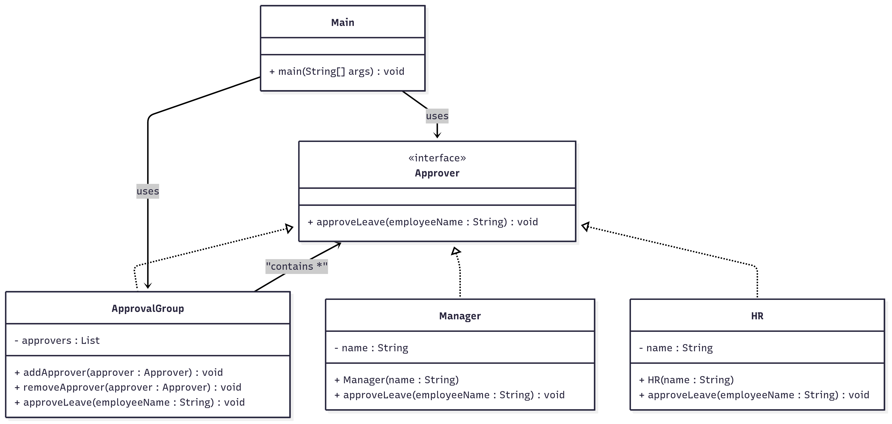

# Composite Pattern - Leave Approval System  

## Use Case  
A *hierarchical leave approval system* where individual approvers (*Manager, HR*) and groups of approvers can be treated uniformly, allowing for flexible approval workflows.  

---

## What It Solves  
- Treats individual approvers and groups of approvers uniformly  
- Builds tree structures of approval hierarchies  
- Allows adding/removing approvers dynamically  
- Simplifies client code when dealing with approval chains  

---

## Classes  

### 🔹 Approver (Interface)  
Defines the component contract.  
- `approveLeave(String employeeName)` → Approves leave for an employee  

### 🔹 Manager  
Leaf component representing a **Manager** approver.  
- Stores manager name  
- Approves leave requests  

### 🔹 HR  
Leaf component representing an **HR** approver.  
- Stores HR name  
- Approves leave requests  

### 🔹 ApprovalGroup  
Composite component that contains multiple approvers.  
- `addApprover(Approver)` → Adds approver to the group  
- `removeApprover(Approver)` → Removes approver from the group  
- `approveLeave(String)` → Delegates approval to all approvers in the group  

### 🔹 Main  
Demonstrates composite pattern by creating individual approvers and grouping them for unified approval process.  

---

##  Class Diagram  

Below is the class diagram representing the composite pattern :  



---

## How to Run  

```bash
# Compile
javac Main.java

# Run
java Main
