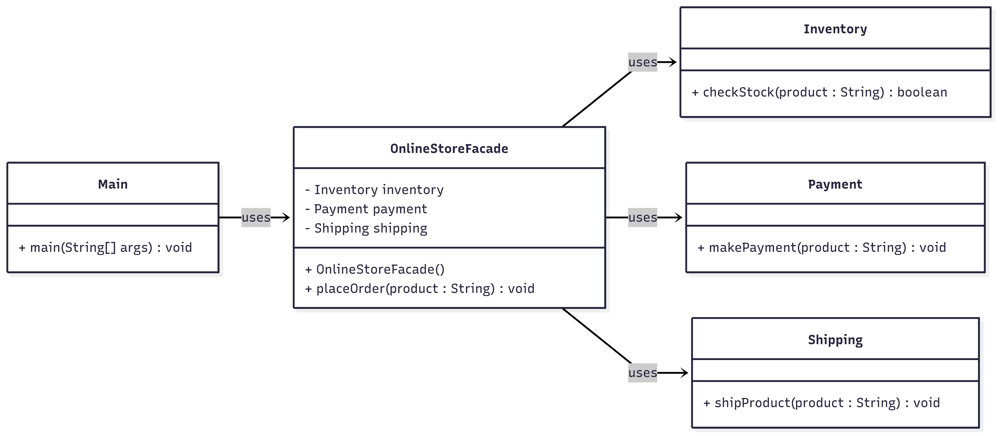

# Facade Pattern - Online Store System  

## Use Case  
An *e-commerce order placement system* that simplifies the complex interactions between inventory, payment, and shipping subsystems into a single unified interface.  

---

## What It Solves  
- Hides complexity of multiple subsystems  
- Provides simple interface for complex operations  
- Reduces client dependencies on subsystem classes  
- Makes the system easier to use and understand  

---

## Classes  

### 🔹 Inventory  
Subsystem for stock management.  
- `checkStock(String product)` → Verifies product availability  

### 🔹 Payment  
Subsystem for payment processing.  
- `makePayment(String product)` → Processes payment transaction  

### 🔹 Shipping  
Subsystem for product delivery.  
- `shipProduct(String product)` → Handles product shipment  

### 🔹 OnlineStoreFacade  
Facade that coordinates all subsystems.  
- Initializes all subsystem instances  
- `placeOrder(String product)` → Orchestrates complete order workflow (check stock → process payment → ship product)  

### 🔹 Main  
Demonstrates facade pattern by placing an order through simplified interface without directly interacting with subsystems.  

---

##  Class Diagram  

Below is the class diagram representing the facade pattern :  



---

## How to Run  

```bash
# Compile
javac Main.java

# Run
java Main
