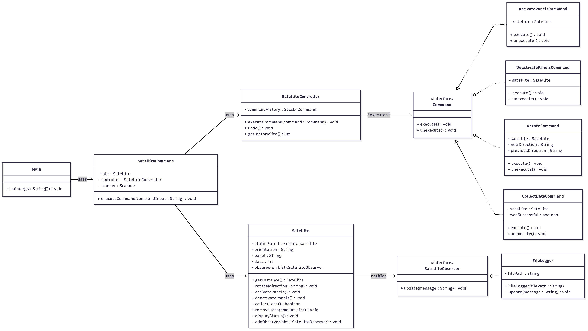
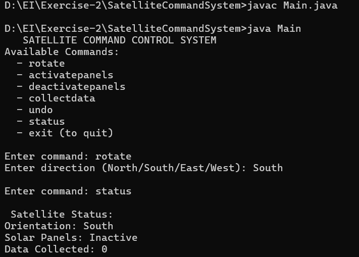
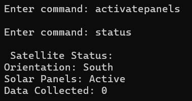
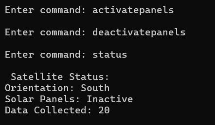
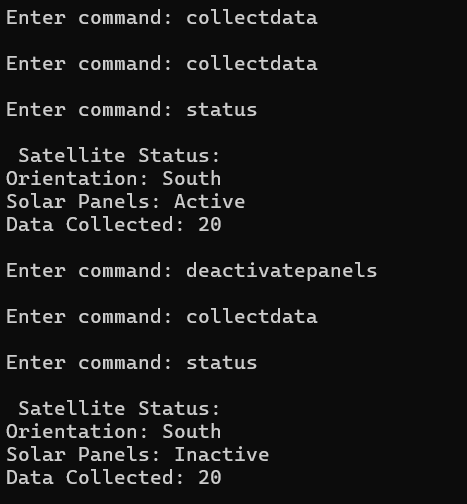
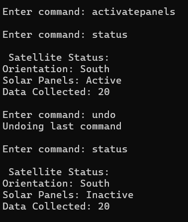
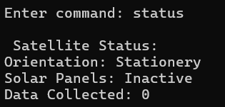
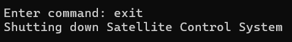
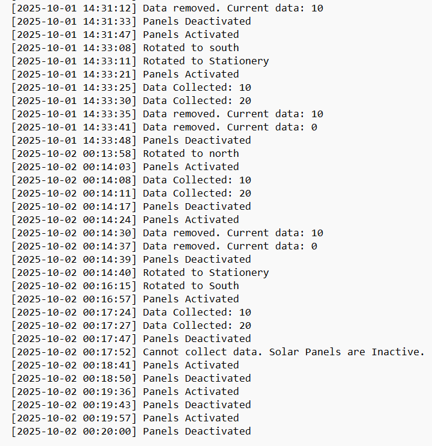

#  Satellite Command Control System  

A *Java-based satellite control system* demonstrating the implementation of *design patterns* for managing satellite operations including rotation, solar panel management, data collection, undo functionality, and activity logging.  

---

##  Use Case Overview  

The *Satellite Command Control System* simulates a *ground control interface* for managing orbital satellite operations.  

### Core Functionalities  
- *Satellite Rotation* → Direct the satellite to face different orientations (*North, South, East, West*)  
- *Solar Panel Management* → Activate or deactivate solar panels for power generation  
- *Data Collection* → Collect scientific data (*only possible when solar panels are active*)  
- *Command History* → Undo previous operations to revert satellite state  
- *Status Monitoring* → View current satellite orientation, panel status, and collected data  
- *Activity Logging* → Automatic *timestamped logging* of all operations to file  

---

##  Use Case Scenarios  

- *Mission Preparation* → Activate solar panels and orient satellite toward target area  
- *Data Gathering* → Collect data while panels are active  
- *Error Recovery* → Use *undo functionality* to revert incorrect commands  
- *Mission Monitoring* → Track all operations through real-time status and log files  

---

##  Design Patterns Used  

### 1. Singleton Pattern  
- *Implementation*: Satellite class  
- *Purpose*: Ensures only one satellite instance exists  
- *Benefits*:  
  - Prevents multiple satellite objects from being created  
  - Provides global access point  
  - Thread-safe implementation (synchronized)  

---

### 2. Command Pattern  
- *Implementation*: Command interface + concrete commands  
- *Purpose*: Encapsulates operations as objects  
- *Benefits*:  
  - Decouples sender from receiver  
  - Enables *undo functionality*  
  - Allows *command queuing* and logging  

*Concrete Commands:*  
- RotateCommand → Changes satellite orientation  
- ActivatePanelsCommand → Activates solar panels  
- DeactivatePanelsCommand → Deactivates solar panels  
- CollectDataCommand → Collects data (only if panels are active)  

---

### 3. Observer Pattern  
- *Implementation*: SatelliteObserver interface + FileLogger  
- *Purpose*: Notifies observers of state changes  
- *Benefits*:  
  - Loose coupling between satellite and logging mechanism  
  - Easy to add new observers (e.g., console logger, DB logger)  
  - Automatic *notification* on every state change  

---

##  Classes Overview  

### 🔹 Command (Interface)  
- Defines execute() and unexecute() methods for all command objects  

### 🔹 RotateCommand  
- Rotates satellite to a specified direction  
- Stores *previous orientation* for undo  

### 🔹 ActivatePanelsCommand  
- Activates solar panels  
- Undo → deactivates them  

### 🔹 DeactivatePanelsCommand  
- Deactivates solar panels  
- Undo → reactivates them  

### 🔹 CollectDataCommand  
- Collects *10 units of data* (only when panels are active)  
- Tracks *success state* for proper undo  

### 🔹 SatelliteController  
- Executes commands  
- Maintains *command history stack*  
- Handles *undo operations*  

### 🔹 SatelliteObserver (Interface)  
- Defines update(String message) for observer notifications  

### 🔹 FileLogger  
- Implements SatelliteObserver  
- Logs timestamped entries to satellite_logs.txt  

### 🔹 Satellite (Singleton)  
- Manages satellite state (*orientation, data, panel status*)  
- Notifies observers on state changes  
- Provides methods for all operations  

### 🔹 Main  
- Entry point  
- Displays menu and manages command input loop  

### 🔹 SatelliteCommand  
- Parses user input  
- Creates appropriate command objects  
- Delegates execution to controller  

---

##  How to Run  

bash
# Compile
javac Main.java

# Run
java Main

---

##  Class Diagram  

Below is the class diagram representing the design patterns and relationships:  

---

##  Output Screenshots  

###  Rotate Command  

###  Activate Panels Command  

###  Deactivate Panels Command  

###  Collect Data Command  

###  Undo Command  

###  Status Command  

###  Exit Command  

###  File Logging   

